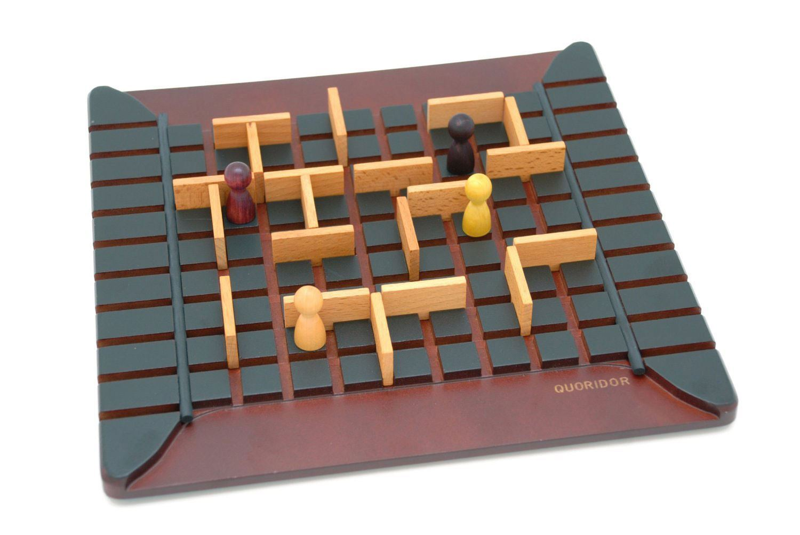

[](https://opensource.org/licenses/MIT) <br />
# Quoridor 
<p align="center">
 
</p>
A simple console application for the Quoridor game. 
You can find more information about Quoridor at https://en.wikipedia.org/wiki/Quoridor.

## How to play quoridor 
Follow the next steps to play: 
```
1. make: compilation
2. ./quoridor: create a new game
3. boardsize 9: set board size. The board size of the official game is 9. The user can also set boardsize to 5 or 7.
4. clear_board: start a new game(set pawns etc.) 
5. walls 5: Set max available walls per player.
6. showboard
7. genmove black: The Computer player will generate a new move.
8. playmove white E2: Player 1 moves its pawn to quare E2(Computer player can be replaced by an "actual" player. Just type playmove black XX).  
9. Repeat steps 7 and 8.
```
:zap:Note: Type 1,2,3,4, and 5 commands in the given order 

## Available commands
* version
* list_commands 
* undo
* walls
* boardsize
* clear_board
* playmove
* playwall
* genmove
* quit
* showboard
* known_command

## Authors
* Petropoulakis Panagiotis petropoulakispanagiotis@gmail.com
* Andreas Charalambous and.charalampous@gmail.com
